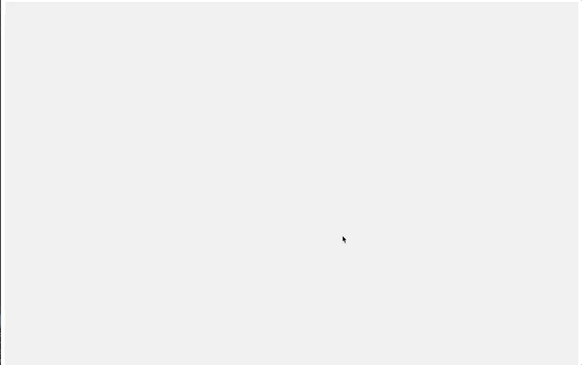

# Scroll Abeja

Este es un ejemplo para que al hacer scroll un elemento se quede fijo en la pantalla.

Porfa tomen en cuenta que la estructura del HTML y las propiedades CSS (en específico postition) juegan un papel importante para que funcione.

